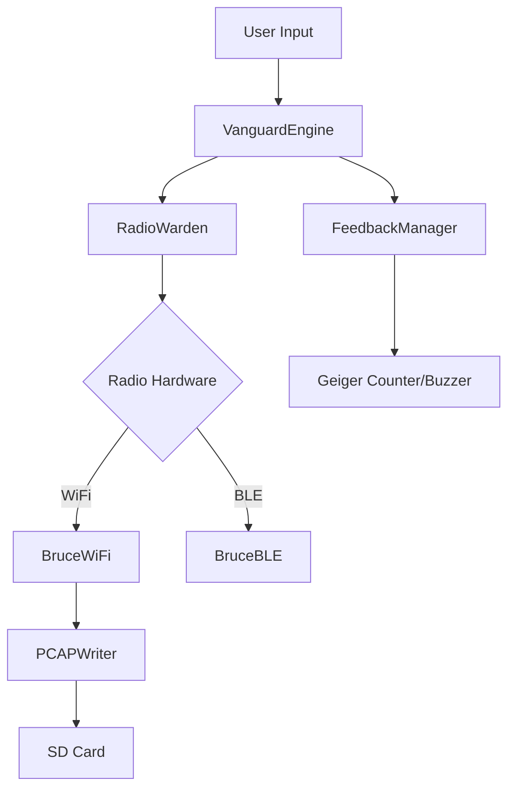

# VANGUARD Alpha 1.1
> **Target First. Always.**

[](https://github.com/Mahdy-gribkov/Task-Oriented-Assesor/actions/workflows/build.yml)
[](https://github.com/Mahdy-gribkov/Task-Oriented-Assesor/releases/tag/rolling-alpha)

VANGUARD is a tactical wireless auditing suite for the **M5Stack Cardputer**. It reverses the traditional "Attack -> Target" workflow, putting discovery first. See the field, pick your mark, and deploy.

---

## ⚡ Alpha 1.1: "The RadioWarden Update"

This iteration brings significant architectural stability and tactile feedback to the platform:

- **🛡️ RadioWarden**: Centralized radio arbitrator. No more "Radio Silence" bugs. Handlers ensure clean handovers between WiFi and BLE protocols.
- **☢️ Geiger Counter**: Real-time audio/haptic feedback. The closer you get to a target, the faster it clicks. Digital signal strength felt through the buzzer.
- **📜 Buffered PCAP**: Asynchronous packet logging. Write full handshakes to SD at high speed without dropping UI frames.
- **🚀 Rolling Releases**: Every commit is now automatically built and released to GitHub for instant deployment.

---

## 🎮 Operative Controls

| Input | Tactical Action |
|-------|-----------------|
| **`M`** | **Inventory/Menu** |
| **`R`** | **WiFi Pulse (Scan)** |
| **`B`** | **BLE Echo (Scan)** |
| **`Enter`** / **`E`** | **Deploy / Select** |
| **`;`** / **`,`** | **Navigate Up** |
| **`.`** / **`/`** | **Navigate Down** |
| **`Q`** / **`Back`** | **Extract / Back** |

---

## 🛠️ Field Deployment

### 1. Requirements
- M5Stack Cardputer (ESP32-S3)
- MicroSD Card (for PCAP logging)
- PlatformIO (CLI or VS Code)

### 2. Quick Start
```powershell
# Quick Build & Flash
pio run -t upload
```

### 3. M5Burner (Coming Soon)
VANGUARD Alpha 1.1 uses a custom 8MB partition table with dual OTA slots, ready for the M5Burner ecosystem.

---

## 📡 Arsenal (Attacks)

### WiFi Operations
- **Deauth All/Single**: Disconnect targets from their access points.
- **Evil Twin**: Clone an AP and intercept credentials (requires SD).
- **Beacon Flood**: Saturate the air with 50+ fake network SSIDs.
- **PMKID Capture**: Invisible handshake extraction for offline cracking.

### BLE Operations
- **Spam**: Flood Apple, Android, and Windows devices with pairing popups.
- **Sour Apple**: Disruption attack targeting iOS/macOS devices.
- **Skimmer Detect**: Identify suspicious BLE signatures common in skimmers.

---

## 🏗️ Architecture



---

## ⚠️ Tactical Warning

**This tool is for authorized security testing only.**
Unauthorized access to wireless networks is a felony in many jurisdictions. The developers assume no liability for misuse.
**If you can't hack responsibly, don't hack at all.**

---

## 📜 Credits & License
Built on the shoulders of:
- **[Bruce](https://github.com/pr3y/Bruce)** (Core Logic)
- **M5Unified** (Hardware HAL)
- **NimBLE-Arduino** (Stack)

License: **GPL-3.0**
